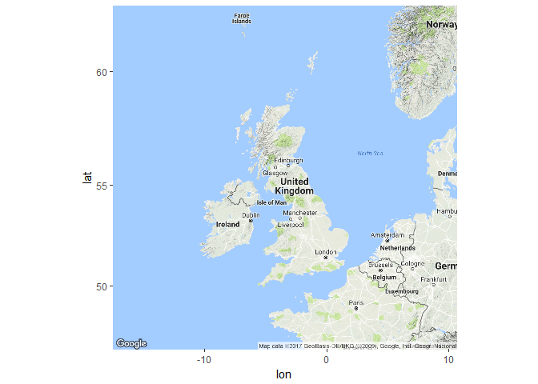
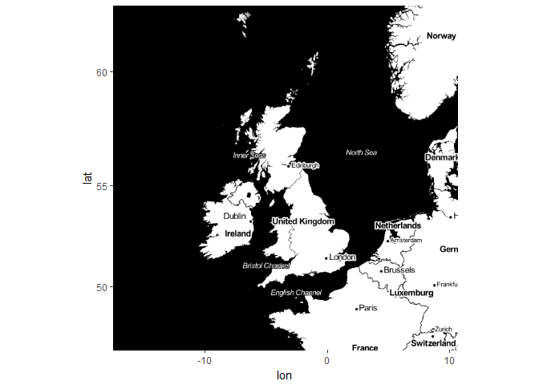
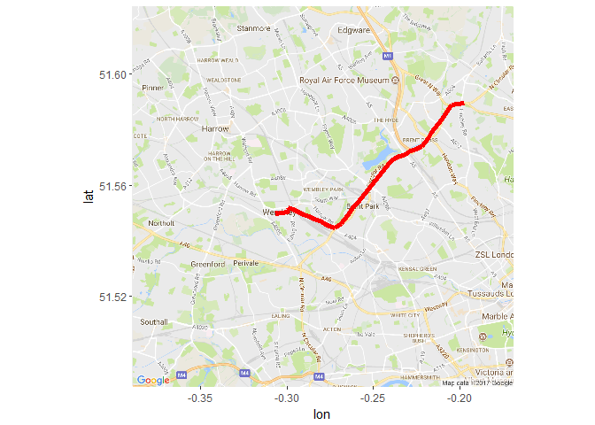

# 공간통계를 위한 데이터 과학
 


## `ggmap` 연습문제를 통한 공간 분석

`ggmap` 연습문제를 통한 공간 분석이 인터넷에 공개되어 이를 한국어로 번역하였다. 영어 원문은 다음을 참조한다.

- [Spatial analysis with ggmap Exercises (part-1)](http://www.r-exercises.com/2017/03/09/spatial-analysis-with-ggmap-exercises-part-1/),
- [Spatial analysis with ggmap Solutions (part-1)](http://www.r-exercises.com/2017/03/09/spatial-analysis-with-ggmap-solutions-part-1/)

## 연습문제 10선 

각 연습문제는 `ggmap`에서 영국 지도를 그리는 것부터 시작한다.
그리고 영국 프리머어 축구리그 주요 구단을 붉은 점으로 지도위에 표시하고, 특히 축구구단이 밀집되어 있는
런던에 서로 다른 색상과 모양으로 구단을 표기한다. 마지막으로 경기장에서 특정 장소까지 운전하여 가는 거리와 소요 시간을 
실시간으로 계산하고 주행경로를 지도위에 표기한다.

### 연습문제 1번

구글 지도 API(Google Maps API)를 통해 영국지도를 얻어오고 적당히 줌인(Zoom In)하여 영국전체 지도가 보이도록 설정한다.


```r
# library(ggmap)
uk <- get_map(location="United Kingdom", zoom=5, maptype='terrain', source='google', color='color')
ggmap(uk)
```

<!-- -->

### 연습문제 2번

`maptype`은 `toner`로 지정하고, 영국지도에 `Stamen` 지도를 적용한다.


```r
uk <- get_map(location="United Kingdom", zoom=5, maptype='toner', source='stamen', color='color')
ggmap(uk)
```

<!-- -->

### 연습문제 3번

영국의 주요 축구구단을 영국지도위에 빨간 점으로 표시하시오.

- 주요축구구단: Arsenal FC, Manchester City FC, Manchester United FC, Liverpool FC, Chelsea FC and Tottenham Hotspur FC. 


```r
club <- c("Arsenal FC", "Manchester City FC", "Manchester United FC",
           "Liverpool FC", "Chelsea FC", "Tottenham Hotspur FC")
club_coord <- geocode(club)

clubs <- bind_cols(club=club, club_coord)

uk <- get_map(location="United Kingdom", zoom=5, maptype='terrain', source='google', color='color')
ggmap(uk) +
  geom_point(aes(x = lon, y = lat), data = clubs, colour = "red", size = 3)
```

<!-- -->

### 연습문제 4번

위도와 경도를 주고 해당하는 위경도(-0.119543, 51.50332)의 주소를 파악하시오.


```r
revgeocode(c(-0.119543, 51.50332), output="address")
```

```
## [1] "30 The Queen's Walk, Lambeth, London SE1 8XX, UK"
```

### 연습문제 5번

런던이 한눈에 보이도록 줌인하여 한 화면에 꽉 차도록 표시하시오.


```r
london <- get_map(location="london", zoom=10, maptype='terrain', source='google', color='color')
ggmap(london)
```

<!-- -->
```

### 연습문제 6번

연습문제 3번에서 표기한 영국 주요 축구구단 중 런던에 해당되는 축구팀만 런던 지도위에 표기되도록 하시오.


```r
club <- c("Arsenal FC", "Tottenham Hotspur FC", "Chelsea FC",
         "West Ham FC", "Crystal Palace FC")
club_coord <- geocode(club)

london_clubs <- bind_cols(club=club, club_coord)

london <- get_map(location="london", zoom=10, maptype='terrain', source='google', color='color')
ggmap(london) +
  geom_point(
    aes(x = lon, y = lat, shape = factor(club), colour=factor(club)),
    data = london_clubs, size = 3
  )
```

<!-- -->

### 연습문제 7번

런던 Emirates 경기장부터 Wembley까지 자동차 주행시 소요되는 거리와 시간을 계산하시오.
거리는 킬로미터, 시간은 분.


```r
distance <- mapdist("Emirates Stadium, London", "Wembley, London", mode="driving", output="simple")

distance$km
```

```
## [1] 19.386
```

```r
distance$minutes
```

```
## [1] 44.46667
```

### 연습문제 8번

런던 Emirates 경기장부터 Wembley까지가 모두 포함되는 최대 줌인 수준을 계산하시오.


```r
coords <- geocode(c("Emirates Stadium, London","Wembley, London"))
calc_zoom(lon, lat, coords)
```

```
## [1] 17
```

### 연습문제 9번

줌인 수준을 12로 두고 Wembley 주변 지도를 구글 지도 API에서 가져온다. 그리고 `maptype`은 `roadmap`으로 한다.


```r
map <- get_map("Wembley", zoom = 12, maptype='roadmap', source='google', color='color')
ggmap(map)
```

<!-- -->


### 연습문제 10번

런던 Emirates 경기장부터 Wembley까지 도로 주행 경로를 표기하는데 색상은 붉은 색으로 처리한다.


```r
Emirates2Wembley <- route("Emirates Stadium, London", "Wembley, London")

map<-get_map("Wembley", zoom = 12, maptype='roadmap', source='google', color='color')

ggmap(map)+
  geom_segment(
    aes(x = startLon, y = startLat, xend = endLon, yend = endLat),
    colour ="red", size = 2, data = Emirates2Wembley
  )
```

<!-- -->
